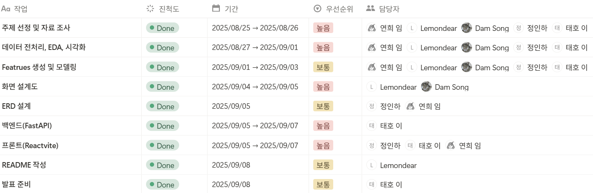
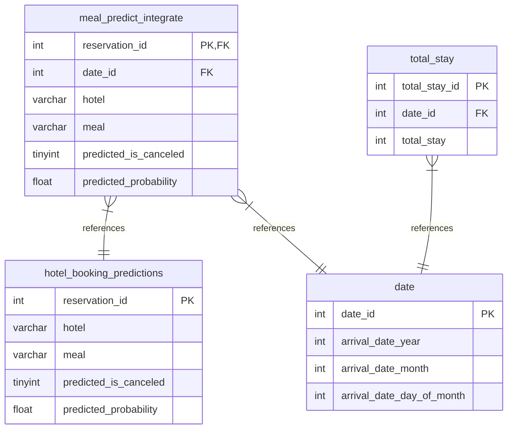
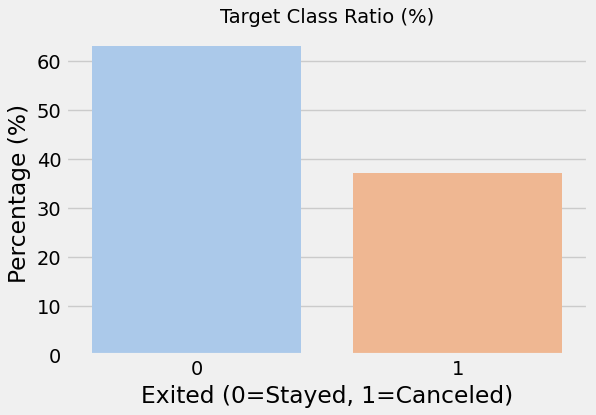
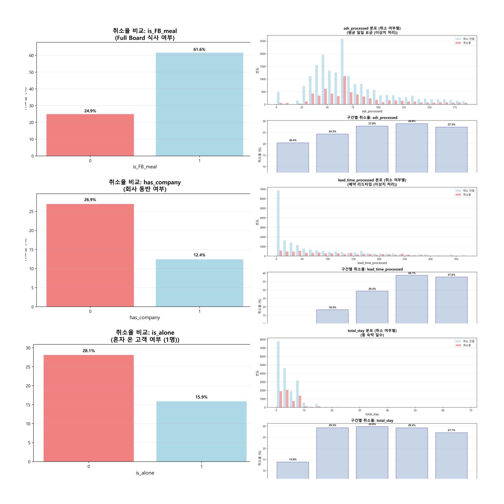
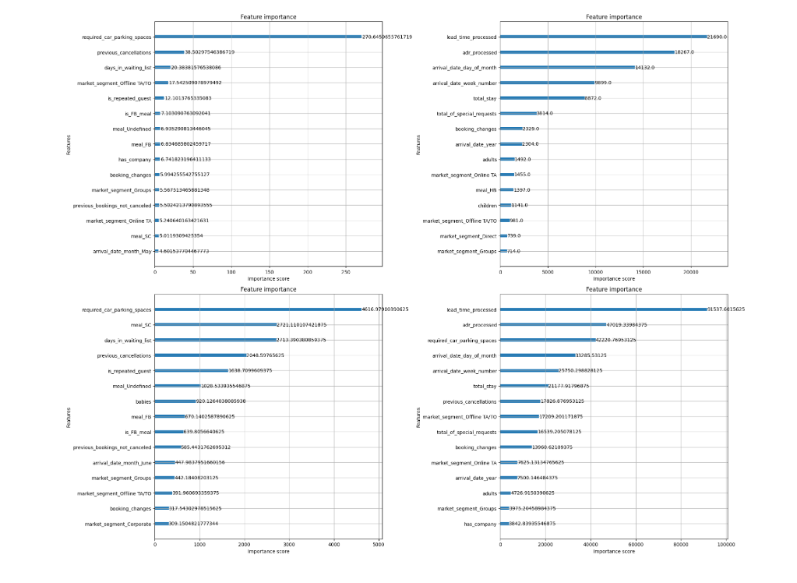
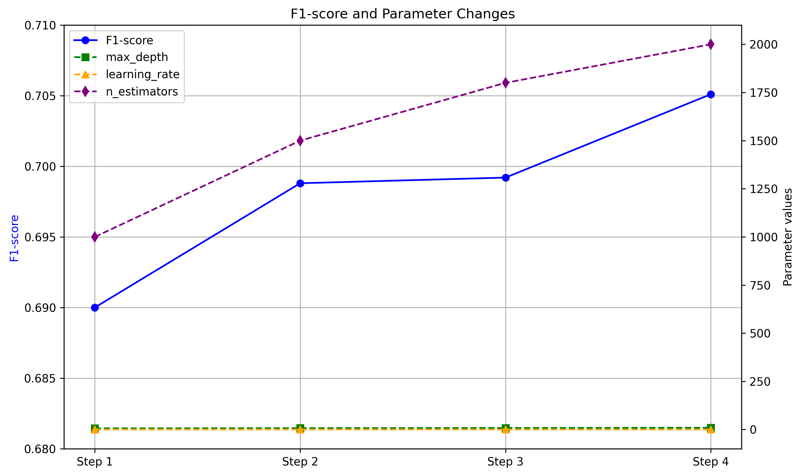

# 🏨 HotelPredict AI - 호텔 예약 관리 시스템

<div align="center">


</div>

---

## 📌 프로젝트 개요

**HotelPredict AI**는 머신러닝을 활용하여 호텔 예약 데이터를 분석하고, **예약 취소율**과 **조식 수요**를 예측하는 지능형 웹 애플리케이션입니다. 호텔 운영자는 이 시스템을 통해 데이터 기반의 의사결정을 내리고, 운영 효율성을 극대화하며, 비용을 절감할 수 있습니다.

<br>

## **팀 소개 : 호텔 델루나**
**SKN18-2nd-5Team** - 호텔 예약 데이터 분석 및 예측 서비스 개발팀

<br>

<table align="center">
  <tr>
    <td align="center" valign="top">
      
      <br />
      <sub><b>이태호</b></sub>
      <br />
      <sub>팀장/지배인</sub>
      <br />
      <a href="https://github.com/william7333" target="_blank">william7333</a>
    </td>
    <td align="center" valign="top">
      
      <br />
      <sub><b>임연희</b></sub>
      <br />
      <sub>부팀장/사장</sub>
      <br />
      <a href="https://github.com/yheeeon" target="_blank">yheeeon</a>
    </td>
    <td align="center" valign="top">
      
      <br />
      <sub><b>정인하</b></sub>
      <br />
      <sub>팀원/유령</sub>
      <br />
      <a href="https://github.com/enapeace" target="_blank">enapeace</a>
    </td>
    <td align="center" valign="top">
      
      <br />
      <sub><b>김담하</b></sub>
      <br />
      <sub>팀원/도어벨</sub>
      <br />
      <a href="https://github.com/DamHA-Kim" target="_blank">DamHA-Kim</a>
    </td>
    <td align="center" valign="top">
      
      <br />
      <sub><b>조준호</b></sub>
      <br />
      <sub>팀원/선비</sub>
      <br />
      <a href="https://github.com/lemondear" target="_blank">lemondear</a>
    </td>
  </tr>
</table>


## ✨ 주요 기능

- **📊 예약 취소 예측**: 특정 날짜의 예상 체크인/취소 건수를 예측하여 오버부킹 전략 및 인력 배치를 최적화합니다.
- **☕ 조식 수요 예측**: 예측된 체크인 인원과 예약 정보를 바탕으로 일별 최적의 조식 준비 인원을 추천하여 음식물 쓰레기를 줄이고 비용을 절감합니다.
- **📅 인터랙티브 대시보드**: 달력 기반의 직관적인 UI를 통해 일별/월별/요일별 예약 트렌드와 예측 정보를 한눈에 파악할 수 있습니다.
- **📈 실시간 통계 분석**: 전체 예약 데이터에 대한 통계와 시각화 자료를 제공하여 비즈니스 인사이트를 도출합니다.

<br>

## 🗓️ WBS



<br>

## ⚙️ 시스템 아키텍처

```mermaid
graph TD
    subgraph User Interface
        A[Frontend (React, Vite)]
    end

    subgraph Services
        B[Backend (FastAPI)]
    end

    subgraph Data & Model
        C[ML Model (Scikit-learn)]
        D[Database (MySQL)]
    end

    A -->|API Requests (Axios)| B;
    B -->|Invoke Prediction| C;
    B <-->|CRUD Operations| D;
    C -->|Load Model & Data| D;
```

<br>

## 🛠️ 기술 스택

| Category | Tech | Description |
| :--- | :--- | :--- |
| **Frontend** | `React`, `Vite` | 동적이고 반응성 높은 사용자 인터페이스 구축 |
| | `React Router` | 클라이언트 사이드 라우팅 관리 |
| | `Axios` | 백엔드 API와의 비동기 HTTP 통신 |
| | `Chart.js` | 데이터 시각화를 위한 차트 라이브러리 |
| | `Framer Motion` | 부드러운 UI 애니메이션 효과 적용 |
| **Backend** | `FastAPI` | 고성능 비동기 웹 API 프레임워크 |
| | `Uvicorn` | ASGI 서버 |
| **ML / Data** | `Scikit-learn` | 예약 취소 예측 모델 (Gradient Boosting) 개발 및 서빙 |
| | `Pandas`, `NumPy` | 데이터 전처리 및 분석 |
| | `Joblib` | 학습된 머신러닝 모델 직렬화/역직렬화 |
| **Database** | `MySQL` | 예약 데이터 및 예측 결과 저장/관리 |

<br>

## 🗄️ 데이터베이스 스키마 (ERD)

`hotel_booking.sql`을 기반으로 생성된 주요 테이블 관계도입니다.



<br>

## 🚀 시작하기

### 1. 사전 요구사항
- Python 3.1 이상
- Node.js 16 이상
- Git
- MySQL

### 2. 설치 및 실행

1.  **저장소 클론**
    ```bash
    git clone https://github.com/SKN18-2nd-5Team/hotel-prediction.git
    cd hotel-prediction
    ```

2.  **데이터베이스 설정**
    - MySQL에 접속하여 `hotelbookings` 데이터베이스를 생성합니다.
    - `hotel_booking.sql` 스크립트를 실행하여 테이블과 데이터를 임포트합니다.
    - `ML/service/database/connection.py` 파일에 DB 연결 정보를 수정합니다.

3.  **백엔드 실행** (새 터미널)
    ```bash
    cd backend
    python -m venv venv
    # Windows
    venv\Scripts\activate
    # macOS/Linux
    # source venv/bin/activate
    pip install -r requirements.txt
    uvicorn main:app --reload --host 0.0.0.0 --port 8000
    ```

4.  **프론트엔드 실행** (새 터미널)
    ```bash
    cd frontend
    npm install --legacy-peer-deps
    npm run dev
    ```

---

## 📊 결측치 및 원시 데이터 확인

```
company                           112593
agent                              16340
country                              488
hotel                                  0
is_canceled                            0
lead_time                              0
arrival_date_year                      0
arrival_date_month                     0
arrival_date_week_number               0
arrival_date_day_of_month              0
stays_in_weekend_nights                0
stays_in_week_nights                   0
adults                                 0
children                               4
babies                                 0
meal                                   0
market_segment                         0
distribution_channel                   0
is_repeated_guest                      0
previous_cancellations                 0
previous_bookings_not_canceled         0
reserved_room_type                     0
assigned_room_type                     0
booking_changes                        0
deposit_type                           0
days_in_waiting_list                   0
customer_type                          0
adr                                    0
required_car_parking_spaces            0
total_of_special_requests              0
reservation_status                     0
reservation_status_date                0
dtype: int64
```

<br>

## 📈 호텔 투숙객 취소율 예측 모델

### 1. 개요
본 프로젝트는 호텔 투숙객 데이터를 분석하여 예약 취소 가능성을 예측하는 머신러닝 모델을 구축하는 것을 목표로 합니다. 호텔 운영 효율성을 높이고, 수익을 극대화하는 데 기여할 수 있습니다.

### 2. 데이터셋 및 컬럼 선정
모델 학습에 필요한 다양한 투숙객 및 예약 정보를 담고 있는 데이터셋을 활용했습니다. 예측에 중요한 영향을 미칠 것으로 예상되는 다음과 같은 컬럼들을 주요 변수로 선정했습니다.

- **개인 정보**: 투숙객의 국적, 연령 등 개인적 특성을 나타내는 변수입니다.

- **예약 정보**: 예약 시기, 숙박 기간, 객실 유형, 식사 옵션 등 예약 관련 정보입니다.

- **지불 정보**: 보증금 유형, 결제 수단 등 재정적 행동을 나타내는 변수입니다.

- **기타 행동 변수**: 특별 요청 사항, 주차 공간 요청 여부 등 투숙객의 추가 행동을 나타내는 정보입니다.

### 3. 주요 분석 및 모델링 과정
프로젝트는 크게 세 단계로 진행됩니다.

- **데이터 전처리**:
    - **결측치 처리**: 누락된 데이터는 중앙값, 최빈값 등으로 채워 분석의 정확도를 높입니다.
    - **범주형 변수 인코딩**: 'City', 'Country'와 같은 범주형 데이터는 머신러닝 모델이 이해할 수 있는 수치 형태로 변환합니다.
    - **Feature Engineering**: lead_time (예약 시점부터 투숙일까지의 기간)과 같은 기존 변수를 활용해 새로운 의미 있는 변수(lead_time의 범주화 등)를 생성하여 모델 성능을 개선합니다.

- **탐색적 데이터 분석 (EDA)**:
    - 취소율에 영향을 미치는 주요 변수들을 시각화하여 상관관계를 파악합니다. 예를 들어, 리드 타임이 길수록 취소율이 높아지는지, 특정 국적에서 취소율이 높은지 등을 분석합니다.

- **모델 학습 및 평가**:
    - **모델 선택**: 로지스틱 회귀(Logistic Regression), 랜덤 포레스트(Random Forest), XGBoost 등 다양한 분류 모델을 사용해 최적의 예측 성능을 가진 모델을 찾습니다.
    - **모델 평가**: 정확도(Accuracy), 정밀도(Precision), 재현율(Recall), F1-Score 등 다양한 평가지표를 활용하여 모델의 성능을 종합적으로 평가합니다.

### 4. 기대 효과
이 모델을 통해 호텔은 예약 취소 가능성이 높은 투숙객을 사전에 파악하여, 오버부킹(overbooking) 전략을 최적화하고 공실률을 최소화할 수 있습니다. 이는 최종적으로 호텔의 수익성 향상으로 이어질 것입니다.


### 5. 데이터 전처리 및 결측치 처리
<div align="center">
  <h4>1. 타겟 컬럼 취소율</h4>
  
</div>

<div align="center">
  <h4>2. 결측치 처리</h4>
</div>


EDA 들어갈 자리


```python
# 결측치 처리
df['company'] = df['company'].fillna(0)
df['agent'] = df['agent'].fillna(0)
df['children'] = df['children'].fillna(0)
df['country'] = df['country'].fillna(df['country'].mode()[0])
```

<div align="center">
  <h4>3. Feature 생성</h4>
</div>

```python

X['total_guests'] = X['adults'] + X['children'] + X['babies']
X['is_alone'] = (X['total_guests'] == 1).astype(int)
X['has_company'] = (X['company'] > 0).astype(int)
X['is_FB_meal'] = np.where(X['meal'] == 'FB', 1, 0)
X['total_stay'] = X['stays_in_weekend_nights'] + X['stays_in_week_nights']
X['is_resort'] = X['hotel'].map({'City Hotel': 0, 'Resort Hotel': 1})

```

<div align="center">
  <h4>4. 인코딩</h4>
</div>




```python
def one_hot_encode_and_align(X_tr: pd.DataFrame, X_te: pd.DataFrame) -> Tuple[pd.DataFrame, pd.DataFrame]:
    X_tr = X_tr.copy()
    X_te = X_te.copy()
    cat_cols = X_tr.select_dtypes(include='object').columns.tolist()
    if len(cat_cols) > 0:
        X_tr = pd.get_dummies(X_tr, columns=cat_cols, drop_first=True)
        X_te = pd.get_dummies(X_te, columns=cat_cols, drop_first=True)
        X_te = X_te.reindex(columns=X_tr.columns, fill_value=0)
    return X_tr, X_te


def drop_original_columns(X_tr: pd.DataFrame, X_te: pd.DataFrame) -> Tuple[pd.DataFrame, pd.DataFrame]:
    X_tr = X_tr.copy()
    X_te = X_te.copy()
    columns_to_drop = [
        'hotel', 'lead_time', 'adr', 'stays_in_weekend_nights',
        'stays_in_week_nights', 'total_guests', 'reserved_room_type',
        'assigned_room_type', 'customer_type',
        'reservation_status',       # 예약 상태 (Check-Out, Canceled, No-Show)
        'reservation_status_date',  # 수천 개의 날짜 컬럼 생성 방지
        'arrival_date_full',        # 수천 개의 날짜 컬럼 생성 방지
        'deposit_type',             # 보증금 타입
        'agent',                    # 에이전트 ID (너무 많은 카테고리)
        'company',                  # 회사 ID (너무 많은 카테고리)
        'country',                  # 국가 (너무 많은 카테고리)
    ]
    X_tr.drop(columns=columns_to_drop, errors='ignore', inplace=True)
    X_te.drop(columns=columns_to_drop, errors='ignore', inplace=True)
    return X_tr, X_te
```

<div align="center">
  <h4>5. Feature Engineering</h4>
</div>

| 변수명 | 설명 |
| :--- | :--- |
| has_company | 회사를 통해 예약하면 취소율이 높을 것이다 |
| has_agent | 에이전트를 통해 예약하면 취소율이 높을 것이다 |
| is_FB_meal | 식사 유형이 FB(full board)일 경우 취소율이 높을 것이다 |
| market_risk_level | 시장 세그먼트에 따른 취소율 위험 정도 |
| is_High_risk_market | market_risk_level이 'High risk'인 경우 취소율이 높을 것이다 |
| adr_processed | 예약 객실 가격을 처리한 값 |
| lead_time_processed | lead_time이 짧으면 취소율이 낮을 것이다 |
| is_alone | 투숙객이 1명일 경우 취소율이 높을 것이다 |
| total | 총 숙박 기간 |
  
<div align="center">
  <h4>6. 상관관계 히트맵</h4>
</div>


<div align="center">
  <h4>7. Feature Importance</h4>
</div>




### 상위 엔지니어링 Feature importance
| 순위 | 피처 | 중요도 |
| :--- | :--- | :--- |
| 1 | is_FB_meal | 7.1 |
| 2 | has_company | 6.7 |
| 3 | lead_time_processed | 4.2 |
| 4 | is_alone | 3.2 |
| 5 | adr_processed | 2.6 |

### Is_canceled 와 상관관계가 높은 Feature
| 피처 | 상관관계 계수 | 특성 |
| :--- | :--- | :--- |
| lead_time_processed | 0.225 | 취소율 증가 요인 |
| is_FB_meal | 0.122 | 취소율 증가 요인 |
| is_alone | -0.110 | 취소율 감소 요인 |


<div align="center">
  <h4>8. 모델 성능 개선</h4>
</div>




### 최종 모델 성능
| 지표 | 훈련 데이터 | 검증 데이터 |
| :--- | :--- | :--- |
| 정확도 (Accuracy) | 0.9508 | 0.8419 |
| 정밀도 (Precision) | 0.8723 | 0.7356 |
| 재현율 (Recall) | 0.9474 | 0.7051 |
| F1-점수 (F1-Score) | 0.9083 | 0.7051 |
| AUC | 0.9852 | 0.8986 |

<div align="center">
  <h4>10. 솔루션 프로토타입: React vite 기반 추천 시스템</h4>
</div>

🍳 서비스 프로토타입: 호텔 조식 준비 및 고객 예측 시스템
본 프로젝트는 호텔 관리자가 효율적으로 조식을 준비하고, 일자별 고객 유형을 파악하여 맞춤형 서비스를 제공할 수 있도록 돕는 웹 애플리케이션입니다. 분석 모델의 예측 결과를 기반으로 호텔 운영의 효율성을 극대화하는 데 중점을 두었습니다.

**주요기능**
예약 유지 예측 기반 조식 준비 수량 추천

- 예측 모델: 예약 취소율 예측 모델을 통해 실제 투숙할 고객 수를 예측합니다.

- 조식 식수 예측 : 예측된 투숙객 수와 조식 포함 예약 비율을 고려하여, 폐기량을 최소화하고 비용을 절감할 수 있는 최적의 조식 준비 수량을 추천합니다.

**일자별 고객 유형 및 특성 분석**

고객 유형 시각화: 특정 날짜를 선택하면, 해당 일에 투숙 예정인 고객들의 주요 특성(예: 연령대, 국적, 예약 채널)을 한눈에 파악할 수 있도록 시각화하여 보여줍니다.

맞춤형 서비스 제공: 관리자는 이 정보를 바탕으로 특정 국적 고객을 위한 맞춤형 서비스를 준비하거나, 가족 단위 고객이 많은 날에는 패밀리 서비스를 강화하는 등 사전 마케팅 및 운영 전략을 수립할 수 있습니다.

**대시보드 기능**

직관적 대시보드: 모든 예측 데이터와 분석 결과는 직관적인 대시보드 형태로 제공됩니다. 복잡한 데이터를 쉽게 이해하고, 신속하게 의사결정을 내릴 수 있도록 돕습니다.

손쉬운 사용: 간단한 날짜 선택만으로 원하는 정보를 즉시 확인할 수 있는 사용자 친화적인 인터페이스를 제공합니다.

**기대효과**
- 비용 절감: 조식 준비 수량을 최적화하여 식자재 낭비를 줄이고, 운영 비용을 절감할 수 있습니다.
- Feature importance 분석을 통하여 취소율에 영향을 미치는 주요 요인을 파악하고, 이를 바탕으로 예약 취소 마케팅 전략을 새롭게 수립할 수 있다.


## 후기

**이태호**
- 모델 하나로 끝나는 게 아니라 전처리·검증·UI 연결에 데이터베이스까지 끝까지 구현해보니 실무에서의 연결 고리들이 얼마나 중요한지 깨달았습니다.
작은 프로토타입으로도 운영 효율(조식 준비 등)에 실질적 기여 가능성을 확인해 보람을 느꼈고, 열심히 따라와준 팀원들에게 고마운 마음이 큽니다.

**임연희**
- 이번 기회에  팀원의 도움을 받아서 git으로 프로젝트를 제대로 활용해볼 수 있었고, 처음으로 React로 페이지를 구현하게 되어  걱정이 많았는데 끝까지 팀원 서로가 도와줬기에 순조롭게 마무리할 수 있었습니다. 5조 최고 !! 👍

**정인하**
- 

**김담하**
-

**조준호**
- 이번 기회에 미숙하지나마 머신러닝을 여러번 다뤄보고 스스로 feature도 생성해보면서 모델 성능을 개선해 보는 경험을 통해 머신러닝에 대해 한층 더 깊이 이해 할 수 있어서 좋았습니다. 새로운 분야인 react에 대해 배울 수 있는 좋은 기회 였습니다.